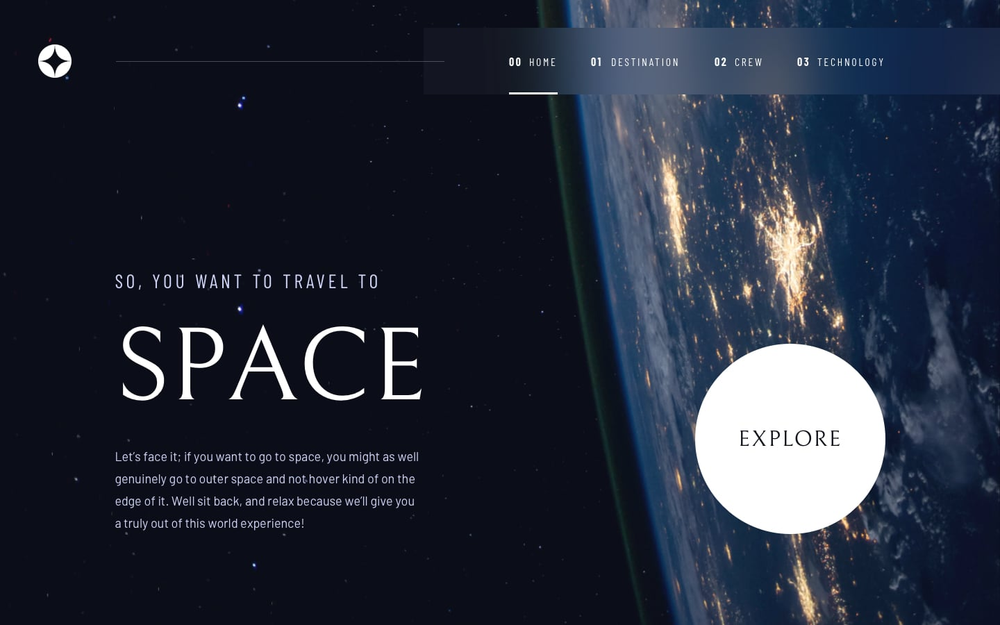

# Frontend Mentor - Space-tourism-website

This is a solution to the [IP address tracker challenge on Frontend Mentor](https://www.frontendmentor.io/challenges/space-tourism-multipage-website-gRWj1URZ3).

## Table of contents

- [Frontend Mentor - Space-tourism-website](#frontend-mentor---space-tourism-website)
  - [Table of contents](#table-of-contents)
  - [Overview](#overview)
    - [The challenge](#the-challenge)
    - [Screenshot](#screenshot)
      - [Assignment Design](#assignment-design)
      - [Current Solution](#current-solution)
    - [Links](#links)
  - [My process](#my-process)
    - [Built with](#built-with)
    - [Continued development](#continued-development)
    - [Known issues](#known-issues)
  - [Author](#author)
- [Execution](#execution)
  - [Available Scripts](#available-scripts)
    - [`npm run dev`](#npm-run-dev)
    - [`npm run build`](#npm-run-build)
    - [`npm run start`](#npm-run-start)

## Overview
### The challenge

Users should be able to:

- View the optimal layout for each of the website's pages depending on their device's screen size
- See hover states for all interactive elements on the page
- View each page and be able to toggle between the tabs to see new information

### Screenshot
#### Assignment Design

#### Current Solution

### Links

<!-- - Solution URL: [Source]() -->
- Live Site URL: [View Site Deploy](https://space-tourism-website-sigma-topaz.vercel.app/)

## My process
This project was bootstrapped with create-next-app@latest with tailwind, using the Next V13 "app" directory workflow and the React client/server components. Dynamic routes were forced in the project for exercise purpose and the solution ended up being halfway dynamic (since the "category" or first level sections are static) but the date of the categories (ex: the "sections") can be extended by adding content in the JSON, handled by the dynamic routes (ex: /category/\[section]).

### Built with

- [Next.js](https://nextjs.org/).
- [Tailwind](https://tailwindcss.com/)

### Continued development

- Migrate to purely static website (no dynamic routes)
- Remove Css Classes

### Known issues

- Layout shifts
## Author

- Website - [Portfolio](https://emkorp.vercel.app)

# Execution

## Available Scripts

In the project directory, you can run:

### `npm run dev`

Runs the app in the development mode.\
Open [http://localhost:3000](http://localhost:3000) to view it in the browser.

### `npm run build`

build the static site \
### `npm run start`
run the site built with `npm run build`

